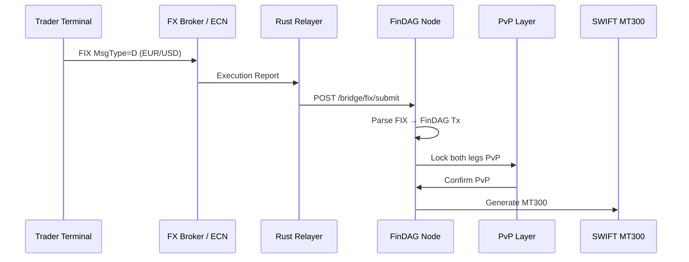
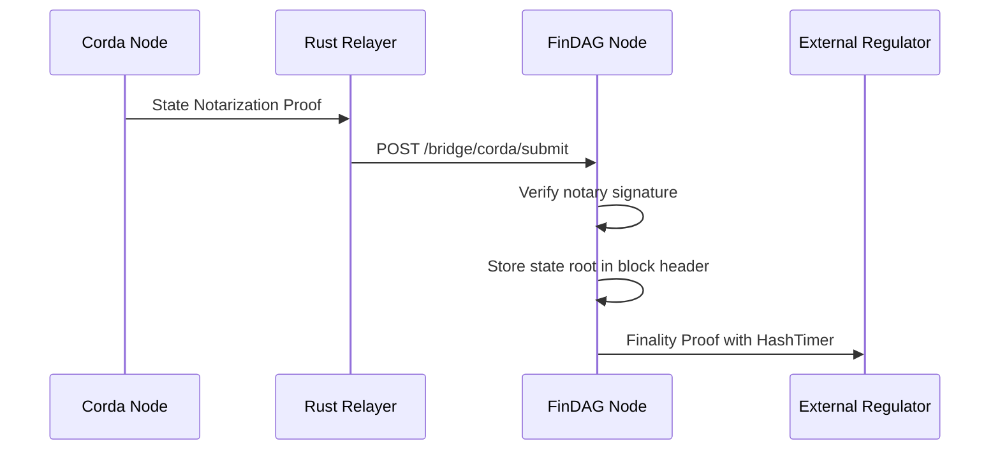

# 🔗 FinDAG Bridge & Interoperability Overview

**FinDAG** is designed to integrate securely with traditional and modern finance systems.  
This document explains how the bridge modules connect FinDAG to existing standards like **SWIFT**, **ISO 20022**, **FIX**, and permissioned blockchains like **Corda** and **Hyperledger Fabric**.

---

## ✅ Supported Protocols & Flows

| Protocol | What it does | How FinDAG connects |
|----------|---------------|---------------------|
| **ISO 20022** | Global standard for financial messages (payments, securities, trade). | `src/iso20022/` module parses XML/JSON messages; submits to DAG. |
| **SWIFT MT** | Legacy SWIFT messages (e.g., MT103, MT300). | `src/swift/` parses MT messages; proofs linked in blocks. |
| **FIX Protocol** | Electronic trading (FX, equities). | `src/fix/` parses Order Single (MsgType=D); converted to FinDAG tx. |
| **Corda** | Permissioned ledger for B2B settlement. | `src/bridge/corda.rs` verifies notary signatures; stores proofs in DAG. |
| **Fabric** | Hyperledger Fabric endorsement proofs. | `src/bridge/fabric.rs` validates MSP endorsements; links state root. |
| **PvP/DvP** | Payment vs Payment or Delivery vs Payment. | FinDAG block finality enforces both legs atomic. |

---

## 🔗 **Bridge Architecture**

```plaintext
[External System] --> [Rust Relayer] --> [FinDAG Node Bridge Endpoint] --> [HashTimer DAG Block]
```

✅ **Rust Relayer**

* Listens to FIX sessions, Corda vault events, or Fabric chaincode outputs.
* Parses and signs proofs.
* Submits via HTTP POST to `/bridge/*/submit`.

✅ **FinDAG Node**

* Validates cryptographic proofs.
* Converts incoming messages to `FinDAGTransaction`.
* Includes proofs in block header.
* Generates finality with HashTimer ordering.

✅ **Backlink**

* Generates SWIFT or ISO messages as needed.
* Provides finality proofs to counterparties.

---

## 🗂️ **Bridge Directories**

```
src/
 ├─ iso20022/   # ISO 20022 XML/JSON parsing, test schemas
 ├─ swift/      # SWIFT MT parsers (MT103, MT300)
 ├─ fix/        # FIX Order Single parsing + converter
 ├─ bridge/
 │   ├─ mod.rs
 │   ├─ api.rs     # Unified HTTP handlers: /bridge/corda, /bridge/fabric, /bridge/fix
 │   ├─ proofs.rs  # SettlementProof trait
 │   ├─ corda.rs   # CordaSettlementProof impl
 │   ├─ fabric.rs  # FabricEndorsementProof impl
```

---

## 🟢 **Example: FIX + PvP**



---

## 🟢 **Example: Corda Settlement**



---

## 🔑 **Key Security Points**

✅ **Cryptographic Proofs:**
Always verified with trusted pubkeys (notaries, MSP roots, or relayer keys).

✅ **HashTimer Finality:**
Every bridge proof is linked with FinDAG's microsecond-ordered HashTimer, producing tamper-evident settlement.

✅ **Replay Safety:**
Proofs should include timestamps or nonce to prevent replay attacks.

✅ **Regulatory Backlink:**
All proofs can be traced back for audit or dispute resolution.

---

## 🏦 **Example Bridge Endpoints**

| Endpoint                     | Description                          |
| ---------------------------- | ------------------------------------ |
| `POST /bridge/fix/submit`    | Accepts FIX Order Single JSON        |
| `POST /bridge/corda/submit`  | Accepts CordaSettlementProof JSON    |
| `POST /bridge/fabric/submit` | Accepts FabricEndorsementProof JSON  |
| `POST /iso20022/submit`      | (Optional) Direct ISO 20022 messages |

---

## ✅ **Next**

* [ ] Add unit tests for all parsers (`mod tests`).
* [ ] Store raw messages for audit trail.
* [ ] Add signature checks for relayer auth.

FinDAG: *Deterministic, verifiable, institutional-grade interoperability.* 