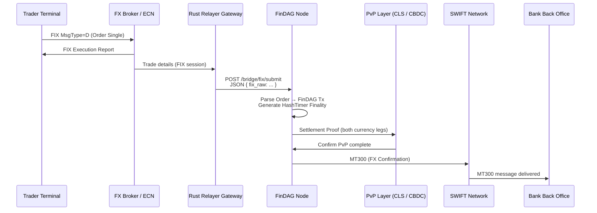

# 📈 FinDAG Interoperable FX Settlement Flow

This document shows how FinDAG integrates **real-time FX trading** with:
- ✅ Industry-standard **FIX Protocol** for electronic orders
- ✅ **PvP (Payment-versus-Payment)** finality with CLS or CBDCs
- ✅ **SWIFT MT300** messages for trade confirmation
- ✅ Verifiable **HashTimer finality** for compliance and auditing

---

## ⚡ Overview

**FinDAG acts as a settlement and proof-of-finality layer**, bridging between traditional financial rails (SWIFT, CLS) and high-speed electronic FX trading venues.

---

## 🔗 **Sequence Diagram**



---

## 🟢 **Flow Breakdown**

1️⃣ **Trader → Broker**
Client submits a spot FX order (e.g., EUR/USD 1M) via **FIX Order Single (MsgType=D)**.

2️⃣ **Broker → Trader**
Broker matches the order or routes it to an ECN. Execution Report confirms fill status.

3️⃣ **Relayer → FinDAG**
A secure Rust relayer parses the raw FIX message and sends it to the FinDAG bridge API:

```
POST /bridge/fix/submit
{
  "fix_raw": "8=FIX.4.2␁11=ORD12345␁55=EUR/USD␁..."
}
```

4️⃣ **FinDAG**

* Parses and validates the order.
* Converts it to an internal `FinDAGTransaction`.
* Locks both currency legs in the DAG.
* Generates a **HashTimer finality proof**.

5️⃣ **PvP Layer (CLS or CBDC)**
Both sides of the FX swap are settled simultaneously (Payment vs Payment). If required, a CLS membership or CBDC connection handles the fiat side.

6️⃣ **SWIFT Confirmation**
A **SWIFT MT300** FX Confirmation message is generated and sent to all counterparties for reconciliation.

7️⃣ **Bank Back Office**
Back office systems use the MT300 for books & records and regulator reporting.

---

## ✅ **Why it matters**

✔️ **Supports FIX Protocol:** no disruption for brokers or ECNs — uses industry standard.

✔️ **Atomic PvP Settlement:** eliminates principal risk — both legs or none.

✔️ **ISO 20022 and SWIFT-ready:** backward compatible with post-trade confirmation flows.

✔️ **Regulatory Grade:** HashTimer ordering and cryptographic proofs deliver audit trails that work for CSDs like Euroclear.

---

## 🏦 **Modules involved**

| Component             | FinDAG Directory                  |
| --------------------- | --------------------------------- |
| FIX Parser            | `src/fix/`                        |
| FIX Bridge Endpoint   | `/bridge/fix/submit`              |
| PvP Finality          | `src/blockchain/` + `src/bridge/` |
| SWIFT MT300 Generator | `src/swift/`                      |
| HashTimer             | `src/utils/`                      |

---

## 🚀 **Next Steps**

* Integrate with your **Rust relayer** or QuickFIX gateway.
* Add **signature verification** for counterparty identity.
* Extend to support FX options (SWIFT MT305) and forwards.

---

**FinDAG: Interoperable. Verifiable. Financial-grade settlement.** 