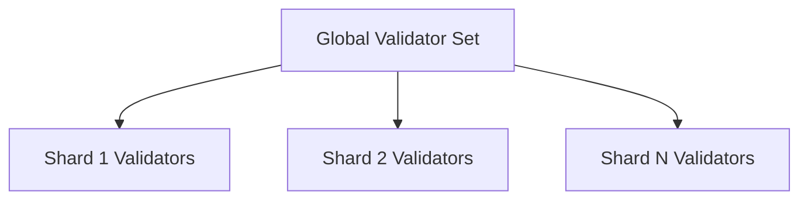
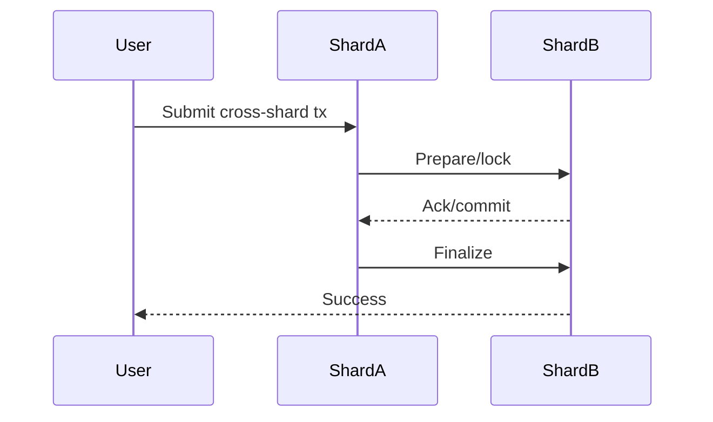

# FinDAG Sharding Architecture Design

---

## 1. Overview
Sharding enables FinDAG to scale horizontally by partitioning the blockchain state and transaction processing across multiple shards. Each shard operates semi-independently, with its own validator set, mempool, and consensus, while cross-shard transactions are coordinated for global consistency.

---

## 2. Shard Assignment & Validator Management
- The network is divided into N shards.
- Each validator is assigned to one or more shards based on stake, governance, or random assignment.
- Validator assignments are managed on-chain and can be updated via governance.
- Shard membership changes are enacted at epoch boundaries.

---

## 3. Cross-Shard Transaction Flow
- Transactions are routed to the originating shard.
- If a transaction affects multiple shards (e.g., asset transfer), a cross-shard protocol is used:
  1. Lock/prepare on source shard
  2. Commit/acknowledge on destination shard
  3. Finalize and update state on both shards
- Atomicity is ensured via a two-phase commit or similar protocol.

---

## 4. Shard State Management & Persistence
- Each shard maintains its own state database (UTXO/account, assets, etc.).
- State roots are periodically checkpointed to the global chain for auditability and recovery.
- Cross-shard receipts are persisted for dispute resolution.

---

## 5. Shard-Aware Mempool & Consensus
- Each shard has an independent mempool, only accepting transactions relevant to its state.
- Consensus (e.g., BFT) runs per-shard, with periodic global coordination for cross-shard finality.
- Validators may participate in multiple shards if assigned.

---

## 6. API & Monitoring Implications
- API endpoints are extended to specify shard (e.g., /shard/{id}/tx, /shard/{id}/state).
- Monitoring tracks per-shard TPS, latency, and health.
- Cross-shard transaction metrics are exposed for observability.

---

## 7. Implementation Phases
1. **Phase 1:** Shard-aware data structures, APIs, and per-shard mempool/consensus (single-shard mode)
2. **Phase 2:** Multi-shard support, validator assignment, and state partitioning
3. **Phase 3:** Cross-shard transaction protocol and atomicity
4. **Phase 4:** Monitoring, recovery, and governance integration

---

## 8. Open Questions & Next Steps
- Shard count adjustment (dynamic vs. static)
- Cross-shard fee and incentive model
- Security against shard takeover (e.g., random assignment, stake weighting)

---

This document will be updated as the design is refined and implementation progresses. 